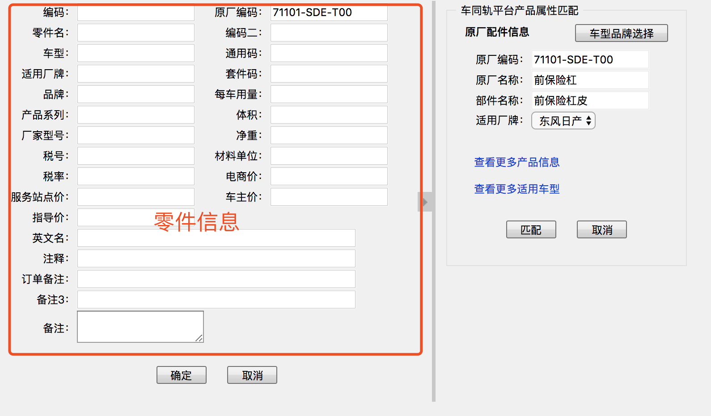

<center style="font-size:22px">车同轨与长远ERP数据对接</center >  

## 需要长远系统提供的接口：
> 以下接口具体的请求参数和返回参数的形式由长远系统确定,只要能确保车同轨系统中能取到对应数据。  

#### 1.通过 零件‘OEM码’+零件所属厂家的厂家id（只要是能唯一确定零件唯一性的条件即可）获取零件的详细信息
该接口用于打开以下界面时获取零件的详细信息


示例：  
**请求参数**：  
```javascript
{  
  "oem":'零件oem码',
  "companyid":'零件所属厂家的厂家id',
}
```
**返回参数**：  
```javascript
{
  "partcode": '编码',
  "oem": '长远系统中的oem码',
  "factorypartname": '零件名',
  "partcode2": '编码二',
  "model": '车型',
  "generalcode": '通用码',
  "longskyfactorylabel": '适用厂牌',
  "suitecode": '套件码',
  "brand": '品牌',
  "usage": '每车用量',
  "series": '产品系列',
  "volume": '体积',
  "factorymodel": '厂家型号',
  "suttle": '净重',
  "taxnum": '税号',
  "materialunit": '材料单位',
  "taxrate": '税率',
  "eprice": '电商价',
  "serviceprice": '服务站点价',
  "ownerprice": '车主价',
  "guideprice": '指导价',
  "englishname": '英文名',
  "comment": '注释',
  "orderremark": '订单备注',
  "remark3": '备注3',
  "remark": '备注',
}
```


#### 2.车同轨要通过该接口，去覆盖长远系统中的‘oem码’。车同轨传递给长远： ‘长远零件OEM码’、‘零件所属厂家的厂家id’、‘零件对应的车同轨原厂件编号’  
示例：  
**请求参数**：  
```javascript
{  
  "oem":'零件oem码',
  "companyid":'零件所属厂家的厂家id',
  "ctgoe":'车同轨原厂件编号'
}
```

## 车同轨提供给长远的测试页面  
数据对接入口：
http://139.129.167.230:8080/ctg_coffee/ctgdata/matchoem.do  
传入参数有：
```javascript
{
  'oem':'长远系统中的零件oem码'，
  'companyid':'零件所属厂家的厂家id'
}
```

有部分UI页面还未出炉，所以那部分的页面信息暂时无法展示（比如产品的详细信息页面、车型品牌的选择页面），会在后续更新后及时提供链接。
