<center style="font-size:26px">EPC Part : Nissan</center >  


### 1. Vin码表  

#### 表字段：  

|序号| 列名          | 类型         | 备注     |
|:--:|:------------:|:------------:|:--------|
|1   |vin           |char(17)      |车辆VIN码|
|2   |produce_date  |char(4)       |生产日期|
|3   |model_code    |varchar(10)   |车型代码|
|4   |model         |varchar(20)   |车型|
|5   |color         |char(3)       |颜色|
|6   |internal_color|char(1)       |内部颜色|
|7   |mark          |smallint(6)   |标号|  

#### 表样：  
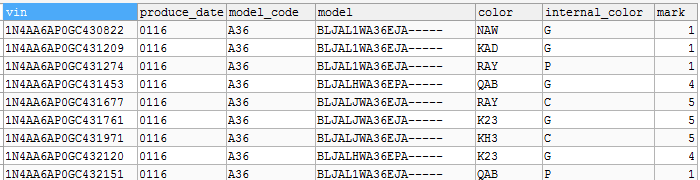

#### 建表语句：  
```sql
CREATE TABLE `nissan_vin_2016` (
  `vin` char(17) NOT NULL COMMENT '车辆VIN码',
  `produce_date` char(4) DEFAULT NULL COMMENT '生产日期（年月）',
  `model_code` varchar(10) DEFAULT NULL COMMENT '车型代码',
  `model` varchar(20) DEFAULT NULL COMMENT '车型',
  `color` char(3) DEFAULT NULL COMMENT '颜色',
  `internal_color` char(1) DEFAULT NULL COMMENT '内部颜色',
  `mark` smallint(6) DEFAULT NULL COMMENT '标号',
  PRIMARY KEY (`vin`)
) ENGINE=InnoDB DEFAULT CHARSET=utf8
```  
### 2. 车型控件属性表  

#### 表字段：  

|序号| 列名          | 类型         | 备注    |
|:--:|:------------:|:------------:|:------- |
|1   |model_code    |varchar(10)   |车型代码 |
|2   |car_body      |varchar(32)   |车身名称 |
|3   |attr1         |varchar(16)   |控件属性1|
|4   |attr2         |varchar(16)   |控件属性2|
|5   |attr3         |varchar(16)   |控件属性3|
|6   |attr4         |varchar(16)   |控件属性4|
|7   |attr5         |varchar(16)   |控件属性5|
|8   |attr6         |varchar(16)   |控件属性6|
|9   |attr7         |varchar(16)   |控件属性7|
|10  |attr8         |varchar(16)   |控件属性8|

#### 表样：  
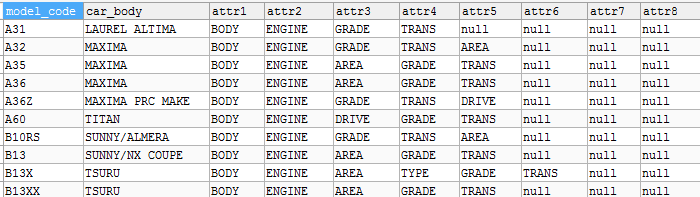

#### 建表语句：  
```sql
CREATE TABLE `nissan_car_attr` (
  `model_code` varchar(10) NOT NULL COMMENT '车型代码',
  `car_body` varchar(32) DEFAULT NULL COMMENT '车身名称',
  `attr1` varchar(16) DEFAULT NULL COMMENT '控件属性1',
  `attr2` varchar(16) DEFAULT NULL COMMENT '控件属性2',
  `attr3` varchar(16) DEFAULT NULL COMMENT '控件属性3',
  `attr4` varchar(16) DEFAULT NULL COMMENT '控件属性4',
  `attr5` varchar(16) DEFAULT NULL COMMENT '控件属性5',
  `attr6` varchar(16) DEFAULT NULL COMMENT '控件属性6',
  `attr7` varchar(16) DEFAULT NULL COMMENT '控件属性7',
  `attr8` varchar(16) DEFAULT NULL COMMENT '控件属性7',
  PRIMARY KEY (`model_code`)
) ENGINE=InnoDB DEFAULT CHARSET=utf8
```  
### 3. 控件属性值表  

#### 表字段：  

|序号| 列名          | 类型         | 备注    |
|:--:|:------------:|:------------:|:------- |
|1   |model_code    |varchar(10)   |车型代码 |
|2   |mark          |smallint(6)   |标号 |
|3   |attr_text1    |varchar(16)   |控件属性1的值|
|4   |attr_text2    |varchar(16)   |控件属性2的值|
|5   |attr_text3    |varchar(16)   |控件属性3的值|
|6   |attr_text4    |varchar(16)   |控件属性4的值|
|7   |attr_text5    |varchar(16)   |控件属性5的值|
|8   |attr_text6    |varchar(16)   |控件属性6的值|
|9   |attr_text7    |varchar(16)   |控件属性7的值|
|10  |attr_text8    |varchar(16)   |控件属性8的值|
|11  |begain_date   |char(4)       |车型开始日期|
|12  |end_date      |char(4)       |车型结束日期|

#### 表样：  
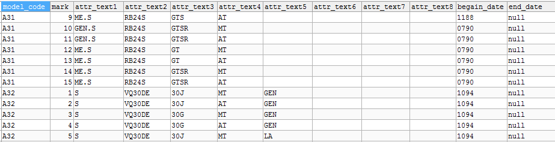

#### 建表语句：  
```sql
CREATE TABLE `nissan_attr_value` (
  `model_code` varchar(10) NOT NULL COMMENT '车型代码',
  `mark` smallint(6) NOT NULL COMMENT '标号',
  `attr_text1` varchar(16) DEFAULT NULL COMMENT '属性值1',
  `attr_text2` varchar(16) DEFAULT NULL COMMENT '属性值2',
  `attr_text3` varchar(16) DEFAULT NULL COMMENT '属性值3',
  `attr_text4` varchar(16) DEFAULT NULL COMMENT '属性值4',
  `attr_text5` varchar(16) DEFAULT NULL COMMENT '属性值5',
  `attr_text6` varchar(16) DEFAULT NULL COMMENT '属性值6',
  `attr_text7` varchar(16) DEFAULT NULL COMMENT '属性值7',
  `attr_text8` varchar(16) DEFAULT NULL COMMENT '属性值8',
  `begain_date` char(4) DEFAULT NULL COMMENT '车型开始日期',
  `end_date` char(4) DEFAULT NULL COMMENT '车型结束日期',
  PRIMARY KEY (`model_code`,`mark`)
) ENGINE=InnoDB DEFAULT CHARSET=utf8
```  
### 4. 零件代码描述表  

#### 表字段：  

|序号| 列名          | 类型         | 备注    |
|:--:|:------------:|:------------:|:------- |
|1   |model_code    |varchar(10)   |车型代码 |
|2   |subgroup      |smallint(6)   |子组 |
|3   |partcode      |varchar(16)   |零件代码|
|4   |partcode_desc |varchar(255)  |零件代码描述|

#### 表样：  
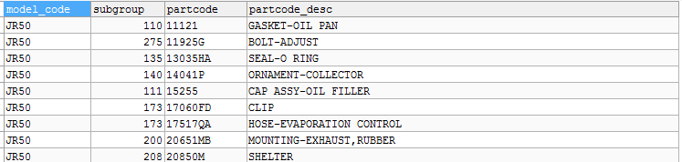

#### 建表语句：  
```sql  
CREATE TABLE `nissan_partdesc` (
  `model_code` varchar(10) DEFAULT NULL COMMENT '车型代码',
  `subgroup` smallint(6) DEFAULT NULL COMMENT '子组',
  `partcode` varchar(16) DEFAULT NULL COMMENT '零件代码',
  `partcode_desc` varchar(255) DEFAULT NULL COMMENT '零件代码描述'
) ENGINE=InnoDB DEFAULT CHARSET=utf8
```  

### 5. 零件图片  

#### 表字段：  

|序号| 列名          | 类型         | 备注    |
|:--:|:------------:|:------------:|:------- |
|1   |model_code    |varchar(10)   |车型代码 |
|2   |subgroup      |smallint(6)   |子组 |
|3   |imgname       |varchar(64)   |图片名称|
|4   |partcode      |varchar(16)   |零件代码|
|5   |coord_y       |smallint(6)   |Y坐标|
|6   |coord_x       |smallint(6)   |X坐标|
|7   |pagecode      |varchar(8)    |页代码|

#### 表样：  
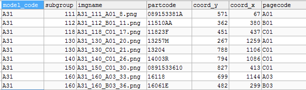

#### 建表语句：  
```sql  
CREATE TABLE `nissan_partimage` (
  `model_code` varchar(10) DEFAULT NULL COMMENT '[车型代码]',
  `subgroup` smallint(6) DEFAULT NULL COMMENT '[子组]',
  `partcode` varchar(16) DEFAULT NULL COMMENT '[零件代码]',
  `imgname` varchar(64) DEFAULT NULL COMMENT '[图片文件名]',
  `coord_y` smallint(6) DEFAULT NULL COMMENT '[y坐标]',
  `coord_x` smallint(6) DEFAULT NULL COMMENT '[x坐标]',
  `pagecode` varchar(8) DEFAULT NULL COMMENT '[页代码]'
) ENGINE=InnoDB DEFAULT CHARSET=utf8
```  
### 6. 配件详情  

#### 表字段：  

|序号| 列名          | 类型         | 备注    |
|:--:|:------------:|:------------:|:------- |
|1   |model_code    |varchar(10)   |车型代码 |
|2   |partcode      |varchar(16)   |零件代码 |
|3   |partnum       |varchar(16)   |零件编号|
|4   |replace_part  |varchar(16)   |替换配件|
|5   |apply_model   |varchar(64)   |应用车型|
|6   |ic            |smallint(6)   |IC|
|7   |begain_date   |char(4)       |配件开始日期|
|8   |end_date      |char(4)       |配件结束日期|
|9   |color         |varchar(10)   |颜色|
|10  |spec          |char(2)       |规格|

#### 表样：  
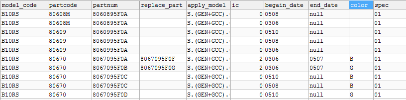

#### 建表语句：  
```sql  
CREATE TABLE `nissan_partdetail` (
  `model_code` varchar(10) DEFAULT NULL COMMENT '车型代码',
  `partcode` varchar(16) DEFAULT NULL COMMENT '零件代码',
  `partnum` varchar(16) DEFAULT NULL COMMENT '零件编号',
  `replace_part` varchar(16) DEFAULT NULL COMMENT '替换配件',
  `apply_model` varchar(64) DEFAULT NULL COMMENT '应用车型',
  `ic` smallint(6) DEFAULT NULL COMMENT 'IC',
  `begain_date` char(4) DEFAULT NULL COMMENT '配件开始时间',
  `end_date` char(4) DEFAULT NULL COMMENT '配件结束时间',
  `color` varchar(10) DEFAULT NULL COMMENT '颜色',
  `spec` char(2) DEFAULT NULL COMMENT '规格'
) ENGINE=InnoDB DEFAULT CHARSET=utf8

--表索引
ALTER TABLE nissan_partdetail ADD INDEX modelcode_partcode (model_code(5),partcode(8));
```  

### 7. 碰撞数据表

#### 表字段：  

|序号| 列名            | 类型         | 备注    |
|:--:|:--------------:|:------------:|:------- |
|1   |model_code      |varchar(10)   |车型代码 |
|2   |partcode        |varchar(16)   |零件代码 |
|3   |partdesc        |varchar(255)  |零件描述|
|4   |collisionsite   |varchar(30)   |碰撞部位|
|5   |collisiondegree |varchar(10)   |碰撞程度|

#### 表样：  
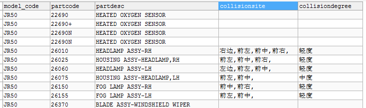

#### 建表语句：  
```sql  
CREATE TABLE `nissan_collision` (
  `model_code` varchar(10) DEFAULT NULL COMMENT '车型代码',
  `partcode` varchar(16) DEFAULT NULL COMMENT '零件代码',
  `partdesc` varchar(255) DEFAULT NULL COMMENT '零件描述',
  `collisionsite` varchar(30) DEFAULT NULL COMMENT '碰撞部位',
  `collisiondegree` varchar(10) DEFAULT NULL COMMENT '碰撞程度'
) ENGINE=InnoDB DEFAULT CHARSET=utf8
```  

### 8. 主组描述

#### 表字段：  

|序号| 列名            | 类型         | 备注    |
|:--:|:--------------:|:------------:|:------- |
|1   |model_code      |varchar(10)   |车型代码 |
|2   |maingroup       |char(1)       |主组 |
|3   |maindesc        |varchar(64)   |主组描述|

#### 表样：  
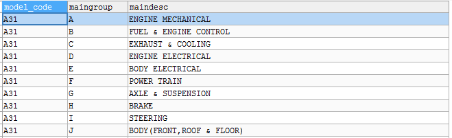

#### 建表语句：  
```sql  
CREATE TABLE `nissan_maindesc` (
  `model_code` varchar(10) NOT NULL COMMENT '车型代码',
  `maingroup` char(1) NOT NULL COMMENT '主组',
  `maindesc` varchar(64) DEFAULT NULL COMMENT '主组描述',
  PRIMARY KEY (`model_code`,`maingroup`)
) ENGINE=InnoDB DEFAULT CHARSET=utf8
```  

### 9. 主组图片

#### 表字段：  

|序号| 列名            | 类型         | 备注    |
|:--:|:--------------:|:------------:|:------- |
|1   |imgname         |varchar(32)   |图片名称 |
|2   |maingroup       |char(1)       |主组 |
|3   |coord_y         |smallint(6)   |Y坐标|
|4   |coord_x         |smallint(6)   |X坐标|

#### 表样：  
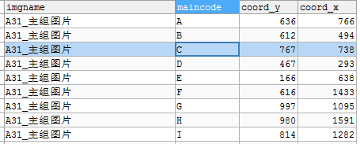

#### 建表语句：  
```sql
CREATE TABLE `nissan_mainimage` (
  `maingroup` char(1) DEFAULT NULL COMMENT '主组',
  `imgname` varchar(32) DEFAULT NULL COMMENT '图片名称',
  `coord_y` smallint(6) DEFAULT NULL COMMENT 'Y坐标',
  `coord_x` smallint(6) DEFAULT NULL COMMENT 'X坐标'
) ENGINE=InnoDB DEFAULT CHARSET=utf8
```  

### 10. 子组描述

#### 表字段：  

|序号| 列名            | 类型         | 备注    |
|:--:|:--------------:|:------------:|:------- |
|1   |model_code      |varchar(10)   |车型代码 |
|2   |maingroup       |char(1)       |主组 |
|3   |subgroup        |smallint(6)   |子组|
|4   |subdesc         |varchar(255)  |子组描述|

#### 表样：  
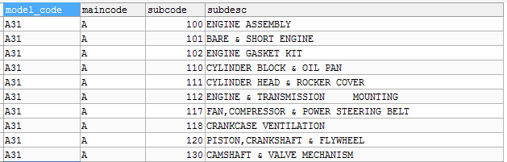

#### 建表语句：  
```sql
CREATE TABLE `nissan_subdesc` (
  `model_code` varchar(10) NOT NULL COMMENT '车型代码',
  `maingroup` char(1) NOT NULL COMMENT '主组',
  `subgroup` smallint(6) NOT NULL COMMENT '子组',
  `subdesc` varchar(255) DEFAULT NULL COMMENT '子组描述',
  PRIMARY KEY (`model_code`,`maincode`,`subcode`)
) ENGINE=InnoDB DEFAULT CHARSET=utf8
```

### 11. 子组图片

#### 表字段：  

|序号| 列名            | 类型         | 备注    |
|:--:|:--------------:|:------------:|:------- |
|1   |imgname         |varchar(32)   |图片名称 |
|2   |maingroup       |char(1)       |主组 |
|3   |subgroup        |smallint(6)   |子组|
|3   |coord_y         |smallint(6)   |Y坐标|
|4   |coord_x         |smallint(6)   |X坐标|

#### 表样：  
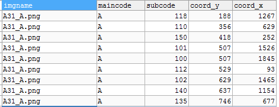

#### 建表语句：  
```sql  
CREATE TABLE `nissan_subimage` (
  `imgname` varchar(32) DEFAULT NULL COMMENT '图片名称',
  `maingroup` char(1) DEFAULT NULL COMMENT '主组',
  `subgroup` smallint(6) DEFAULT NULL COMMENT '子组',
  `coord_y` smallint(6) DEFAULT NULL COMMENT 'Y坐标',
  `coord_x` smallint(6) DEFAULT NULL COMMENT 'X坐标'
) ENGINE=InnoDB DEFAULT CHARSET=utf8
```  

### 12. 子组应用车型

#### 表字段：  

|序号| 列名            | 类型         | 备注    |
|:--:|:--------------:|:------------:|:------- |
|1   |model_code      |varchar(10)   |车型代码 |
|2   |subgroup         |smallint(6)   |子组 |
|3   |subpage         |char(5)       |子组页码|
|3   |apply_car       |varchar(128)  |子组应用车型|
|4   |apply_spec      |varchar(128)  |子组应用规格|
|4   |begain_date     |char(4)       |开始日期|
|4   |end_date        |char(4)       |结束日期|

#### 表样：  


#### 建表语句：  
```sql
CREATE TABLE `nissan_subapply` (
  `model_code` varchar(10) DEFAULT NULL COMMENT '车型代码',
  `subgroup` smallint(6) DEFAULT NULL COMMENT '子组',
  `subpage` char(5) DEFAULT NULL COMMENT '子组页码',
  `apply_car` varchar(128) DEFAULT NULL COMMENT '子组应用车型',
  `apply_spec` varchar(128) DEFAULT NULL COMMENT '子组应用规格',
  `begain_date` char(4) DEFAULT NULL COMMENT '开始日期',
  `end_date` char(4) DEFAULT NULL COMMENT '结束日期'
) ENGINE=InnoDB DEFAULT CHARSET=utf8
```
