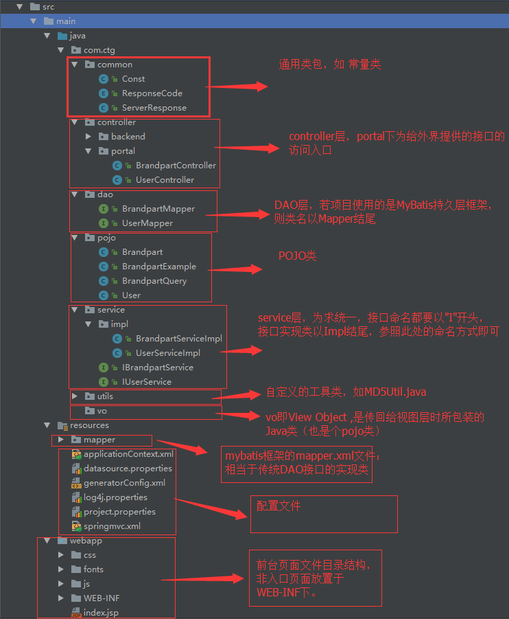

<!-- ## 目录
  [一、编程规约](#bianchengguiyue)  
  [（一）命名规约](#mingmingguiyue) -->
<center style="font-size:26px">车同轨科技有限公司JAVA开发规范</center >  

<a name="bianchengguiyue--primitives"></a><a name="1.1"></a>
## 一、编程规约  

<a name="mingmingguiyue--primitives"></a><a name="1.1"></a>
### （一）命名规约  

1. **【强制】** 代码中的命名严禁使用拼音与英文混合的方式，更不允许直接使用中文的方式。 说明：正确的英文拼写和语法可以让阅读者易于理解，避免歧义。注意，即使纯拼音命名方式也要避免采用。  
<font color=#ff0033>反例</font>： DaZhePromotion [打折] / getPingfenByName() [评分] / int 某变量 = 3   
<font color=#00ff00>正例</font>： alibaba / taobao / youku / hangzhou 等国际通用的名称，可视同英文。

2. **【强制】** 方法名、参数名、成员变量、局部变量都统一使用lowerCamelCase风格，必须遵从驼峰形式。  
<font color=#00ff00>正例</font>： localValue / getHttpMessage() / inputUserId

3. **【强制】** 常量命名全部大写，单词间用下划线隔开，力求语义表达完整清楚，不要嫌名字长。  
<font color=#ff0033>反例</font>： MAX_COUNT   
<font color=#00ff00>正例</font>： MAX_STOCK_COUNT  

4. **【推荐】** 接口类中的方法和属性不要加任何修饰符号（public 也不要加），保持代码的简洁性，并加上有效的Javadoc注释。尽量不要在接口里定义变量，如果一定要定义变量，肯定是与接口方法相关，并且是整个应用的基础常量。  
<font color=#00ff00>正例</font>：接口方法签名：void f(); 接口基础常量表示：String COMPANY = "ctg";  
<font color=#ff0033>反例</font>：接口方法定义：public abstract void f();    

5. **【强制】** 对于Service和DAO类，基于SOA(Service-Oriented Architecture)的理念，暴露出来的服务一定是接口，内部的实现类用Impl的后缀与接口区别。接口命名以"I"开头，如IUserService，其实现类以Impl结尾，如UserServiceImpl。  
<font color=#00ff00>正例</font>：UserServiceImpl实现IUserService接口。  

6. **【强制】** POJO类中布尔类型的变量，都不要加is，否则部分框架解析会引起序列化错误。  
<font color=#ff0033>反例</font>：定义为基本数据类型Boolean isDeleted；的属性，它的方法也是isDeleted()，RPC框架在反向解析的时候，“以为”对应的属性名称是deleted，导致属性获取不到，进而抛出异常。  

7. **【参考】** 各层命名规约：  
A) Service/DAO层方法命名规约  
　　1） 获取单个对象的方法用get做前缀。  
　　2） 获取多个对象的方法用list做前缀。  
　　3） 获取统计值的方法用count做前缀。  
　　4） 插入的方法用save（推荐）或insert做前缀。  
　　5） 删除的方法用remove（推荐）或delete做前缀。  
　　6） 修改的方法用update做前缀。  
  B) 领域模型命名规约  
  　　1） 数据对象：xxxDO，xxx即为数据表名。  
  　　2） 数据传输对象：xxxDTO，xxx为业务领域相关的名称。  
  　　3） 展示对象：xxxVO，xxx一般为网页名称。  
  　　4） POJO是DO/DTO/BO/VO的统称，禁止命名成xxxPOJO。　　

### （二）代码格式
1. **【强制】**  大括号的使用约定。如果是大括号内为空，则简洁地写成{}即可，不需要换行；如果是非空代码块则：  
  1） 左大括号前不换行。  
  2） 左大括号后换行。  
  3） 右大括号前换行。  
  4） 右大括号后还有else等代码则不换行；表示终止的右大括号后必须换行。

2. **【强制】**  左小括号和字符之间不出现空格；同样，右小括号和字符之间也不出现空格。详见第5条下方正例提示。 反例：if (空格a == b空格)  
<font color=#ff0033>反例</font>：if (空格a == b空格)

3. **【强制】** if/for/while/switch/do等保留字与括号之间都必须加空格。

4. **【强制】** 任何二目、三目运算符的左右两边都需要加一个空格。 说明：运算符包括赋值运算符=、逻辑运算符&&、加减乘除符号等。

5. **【强制】** 缩进采用4个空格，禁止使用tab字符。  
说明： 如果使用 tab 缩进，必须设置 1个 tab 为 4个空格。 IDEA 设置 tab 为 4个空格时， 请勿勾选 Use tab character ；而在 eclipse 中，必须勾选 insert spaces for tabs 。  
<font color=#00ff00>正例</font>：（涉及1-5点）  
```Java
    public static void main(String[] args) {
        // 缩进4个空格
        String say = "hello";
        // 运算符的左右必须有一个空格
        int flag = 0;
        // 关键词if与括号之间必须有一个空格，括号内的f与左括号，0与右括号不需要空格
        if (flag == 0) {
            System.out.println(say);
        }
        // 左大括号前加空格且不换行；左大括号后换行
        if (flag == 1) {
            System.out.println("world");
            // 右大括号前换行，右大括号后有else，不用换行
        } else {
            System.out.println("ok");
            // 在右大括号后直接结束，则必须换行
        }
    }
```

6. **【强制】** 单行字符数限不超过 120 个，超出需要换行时 个，超出需要换行时遵循如下原则：  
1） 第二行相对一缩进 4个空格，从第三行开始不再继续缩进参考示例。  
2） 运算符与下文一起换行。  
3） 方法调用的点符号与下文一起换行。  
4） 在多个参数超长，在逗号后换行。  
5） 在括号前不要换行，见反例。  

<font color=#00ff00>正例</font>：  
```Java
  StringBuffer sb = new StringBuffer();
  //超过120个字符的情况下，换行缩进4个空格，并且方法前的点符号一起换行
  sb.append("zi").append("xin")...
  .append("huang")...
  .append("huang")...
  .append("huang");
```
<font color=#ff0033>反例</font>：　　
```Java
  StringBuffer sb = new StringBuffer();
  //超过120个字符的情况下，不要在括号前换行
  sb.append("zi").append("xin")...append
  ("huang");
  //参数很多的方法调用可能超过120个字符，不要在逗号前换行
  method(args1, args2, args3, ...
  , argsX);
```  

7. **【强制】** 方法参数在定义和传入时，多个参数逗号后边必须加空格。  
<font color=#00ff00>正例</font>：下例中实参的 "a", 后边必须要有一个空格。  
method("a", "b", "c");  

8. **【强制】** IDE的text file encoding设置为UTF-8; IDE中文件的换行符使用Unix格式，不要使用windows格式。  

### （三）OOP规约  
1. **【强制】** 所有的覆写方法，必须加@Override注解。  
说明：getObject()与get0bject()的问题。一个是字母的O，一个是数字的0，加@Override可以准确判断是否覆盖成功。另外，如果在抽象类中对方法签名进行修改，其实现类会马上编译报错。

2. 关于基本数据类型与包装数据类型的使用标准如下：  
1） **【强制】** 所有的POJO类属性必须使用包装数据类型。  
2） **【强制】** RPC方法的返回值和参数必须使用包装数据类型。  
3） **【推荐】** 所有的局部变量使用基本数据类型。  
说明：POJO类属性没有初值是提醒使用者在需要使用时，必须自己显式地进行赋值，任何NPE问题，或者入库检查，都由使用者来保证。  
<font color=#00ff00>正例</font>： 数据库的查询结果可能是null，因为自动拆箱，用基本数据类型接收有NPE风险。  

3. **【强制】** 定义DO/DTO/VO等POJO类时，不要设定任何属性默认值。  
<font color=#ff0033>反例</font>： POJO类的create_time默认值为new Date();但是这个属性在数据提取时并没有置入具体值，在更新其它字段时又附带更新了此字段，导致创建时间被修改成当前时间。  

4. **【强制】** 序列化类新增属性时，请不要修改serialVersionUID字段，避免反序列失败；如果完全不兼容升级，避免反序列化混乱，那么请修改serialVersionUID值。  
说明：注意serialVersionUID不一致会抛出序列化运行时异常。  

5. **【强制】** 构造方法里面禁止加入任何业务逻辑，如果有初始化逻辑，请放在init方法中。  

6. **【强制】** POJO类必须写toString方法。使用IDE的中工具：source> generate toString时，如果继承了另一个POJO类，注意在前面加一下super.toString。  
说明：在方法执行抛出异常时，可以直接调用POJO的toString()方法打印其属性值，便于排查问题。  

7. **【推荐】** 当一个类有多个构造方法，或者多个同名方法，这些方法应该按顺序放置在一起，便于阅读。  

8. **【推荐】** 类内方法定义顺序依次是：公有方法或保护方法 > 私有方法 > getter/setter方法。  
说明：公有方法是类的调用者和维护者最关心的方法，首屏展示最好；保护方法虽然只是子类关心，也可能是“模板设计模式”下的核心方法；而私有方法外部一般不需要特别关心，是一个黑盒实现；因为方法信息价值较低，所有Service和DAO的getter/setter方法放在类体最后。  

9. **【推荐】** setter方法中，参数名称与类成员变量名称一致，this.成员名 = 参数名。在getter/setter方法中，不要增加业务逻辑，增加排查问题的难度。  
<font color=#ff0033>反例</font>：  
```Java
    public Integer getData() {
      if (true) {
        return this.data + 100;
      } else {
        return this.data - 100;
      }
    }
```  

### （四）控制语句  
1） **【强制】** 在一个switch块内，每个case要么通过break/return等来终止，要么注释说明程序将继续执行到哪一个case为止；在一个switch块内，都必须包含一个default语句并且放在最后，即使它什么代码也没有。  

2） **【强制】** 在if/else/for/while/do语句中必须使用大括号。即使只有一行代码，避免使用单行的形式：if (condition) statements;  

3） **【推荐】** 除常用方法（如getXxx/isXxx）等外，不要在条件判断中执行其它复杂的语句，将复杂逻辑判断的结果赋值给一个有意义的布尔变量名，以提高可读性。  
说明：很多if语句内的逻辑相当复杂，阅读者需要分析条件表达式的最终结果，才能明确什么样的条件执行什么样的语句，那么，如果阅读者分析逻辑表达式错误呢？  
<font color=#00ff00>正例</font>：  
```Java
//伪代码如下
final boolean existed = (file.open(fileName, "w") != null) && (...) || (...);
if (existed) {
    ...
}
```  
<font color=#ff0033>反例</font>：  
```Java
if ((file.open(fileName, "w") != null) && (...) || (...)) {
    ...
}
```  

4) **【推荐】** 循环体中的语句要考量性能，以下操作尽量移至循环体外处理，如定义对象、变量、获取数据库连接，进行不必要的try-catch操作（这个try-catch是否可以移至循环体外）。  

### （五）注释规约  
1） **【强制】** 类、类属性、类方法的注释必须使用Javadoc规范，使用/**内容 */ 格式，不得使用//xxx方式。  
说明：在IDE编辑窗口中，Javadoc方式会提示相关注释，生成Javadoc可以正确输出相应注释；在IDE中，工程调用方法时，不进入方法即可悬浮提示方法、参数、返回值的意义，提高阅读效率。

2） **【强制】**  所有的抽象方法（包括接口中的方法）必须要用Javadoc注释、除了返回值、参数、异常说明外，还必须指出该方法做什么事情，实现什么功能。  
说明：对子类的实现要求，或者调用注意事项，请一并说明。

3） **【强制】** 所有的类都必须添加创建者和创建日期。

4） **【强制】** 方法内部单行注释，在被注释语句上方另起一行，使用//注释。方法内部多行注释使用/* */注释，注意与代码对齐。  

5） **【强制】** 所有的枚举类型字段必须要有注释，说明每个数据项的用途。

6） 与其“半吊子”英文来注释，不如用中文注释把问题说清楚。专有名词与关键字保持英文原文即可。  
<font color=#ff0033>反例</font>：“TCP连接超时”解释成“传输控制协议连接超时”，理解反而费脑筋。  

7）**【推荐】** 代码修改的同时，注释也要进行相应的修改，尤其是参数、返回值、异常、核心逻辑等的修改。  
说明：代码与注释更新不同步，就像路网与导航软件更新不同步一样，如果导航软件严重滞后，就失去了导航的意义。  

8）**【参考】** 合理处理注释掉的代码。在上方详细说明，而不是简单的注释掉。如果无用，则删除。  
说明：代码被注释掉有两种可能性：1）后续会恢复此段代码逻辑。2）永久不用。前者如果没有备注信息，难以知晓注释动机。后者建议直接删掉（代码仓库保存了历史代码）。  

9）**【参考】** 对于注释的要求：第一、能够准确反应设计思想和代码逻辑；第二、能够描述业务含义，使别的程序员能够迅速了解到代码背后的信息。完全没有注释的大段代码对于阅读者形同天书，注释是给自己看的，即使隔很长时间，也能清晰理解当时的思路；注释也是给继任者看的，使其能够快速接替自己的工作。  

10）**【参考】** 好的命名、代码结构是自解释的，注释力求精简准确、表达到位。避免出现注释的一个极端：过多过滥的注释，代码的逻辑一旦修改，修改注释是相当大的负担。  
<font color=#ff0033>反例</font>：  
```Java
    // put elephant into fridge
    put(elephant, fridge);
```  
方法名put，加上两个有意义的变量名elephant和fridge，已经说明了这是在干什么，语义清晰的代码不需要额外的注释。   


11） **【参考】** 特殊注释标记，请注明标记人与标记时间。注意及时处理这些标记，通过标记扫描，经常清理此类标记。线上故障有时候就是来源于这些标记处的代码。  
 > 1）待办事宜（TODO）:（ 标记人，标记时间，[预计处理时间]）  
 表示需要实现，但目前还未实现的功能。这实际上是一个Javadoc的标签，目前的Javadoc还没有实现，但已经被广泛使用。只能应用于类，接口和方法（因为它是一个Javadoc标签）。  
 2）错误，不能工作（FIXME）:（标记人，标记时间，[预计处理时间]）  
 在注释中用FIXME标记某代码是错误的，而且不能工作，需要及时纠正的情况。  

 ## 二、MySQL数据库  
 ### （1）建表规约  
 1. **【强制】** 表达是与否概念的字段，必须使用is_xxx的方式命名，数据类型是unsigned tinyint（ 1表示是，0表示否）。  
 说明：任何字段如果为非负数，必须是unsigned。  
 <font color=#00ff00>正例</font>： 表达逻辑删除的字段名 is_deleted，1表示删除， 0表示未删除。 表

 2. **【强制】** 表名、字段名<font color=#f45b41>必须使用小写字母或数字</font>，禁止出现数字开头，禁止两个下划线中间只出现数字。<font color=#f45b41>数据库字段名的修改代价很大，所以字段名称需要慎重考虑</font>。  
 <font color=#00ff00>正例</font>：getter_admin，task_config，level3_name  
 <font color=#ff0033>反例</font>：GetterAdmin，taskConfig，level_3_name

 3. **【强制】** 表名不使用复数名词。  
 说明：表名应该仅仅表示表里面的实体内容，不应该表示实体数量，对应于DO类名也是单数形式，符合表达习惯。

 4. **【强制】** 禁用保留字，如desc、range、match、delayed等，请参考MySQL官方保留字。  

 5. **【强制】** 主键索引名为pk_字段名；唯一索引名为uk_字段名；普通索引名则为idx_字段名。  
 说明：pk_ 即primary key；uk_ 即 unique key；idx_ 即index的简称。  

 6. **【强制】** 小数类型为decimal，禁止使用float和double。  
说明：float和double在存储的时候，存在精度损失的问题，很可能在值的比较时，得到不正确的结果。如果存储的数据范围超过decimal的范围，建议将数据拆成整数和小数分开存储。

 7. **【强制】** 如果存储的字符串长度几乎相等，使用char定长字符串类型。  

 8. **【强制】** 表必备三字段：id, create_time, update_time。  
说明：其中id必为主键，类型为unsigned bigint、单表时自增、步长为1。create_time, update_time的类型均为date_time类型。

 9. **【推荐】** 表的命名最好是加上“业务名称_表的作用”。  
 <font color=#00ff00>正例</font>：tiger_task / tiger_reader / mpp_config  

 10. **【推荐】** 库名与应用名称尽量一致。  

 11. **【推荐】** 如果修改字段含义或对字段表示的状态追加时，需要及时更新字段注释。

 12. **【推荐】** 字段允许适当冗余，以提高查询性能，但必须考虑数据一致。冗余字段应遵循：  
 1）不是频繁修改的字段。  
 2）不是varchar超长字段，更不能是text字段。 正例：商品类目名称使用频率高，字段长度短，名称基本一成不变，可在相关联的表中冗余存储类目名称，避免关联查询。

 13. **【推荐】** 单表行数超过500万行或者单表容量超过2GB，才推荐进行分库分表。  
 说明：如果预计三年后的数据量根本达不到这个级别，请不要在创建表时就分库分表。

 14. **【参考】** 合适的字符存储长度，不但节约数据库表空间、节约索引存储，更重要的是提升检索速度。  
 <!-- <font color=#00ff00>正例</font>：如下表，其中无符号值可以避免误存负数，且扩大了表示范围。    -->
<!--
    | 对象 | 年龄区间 | 类型 | 表示范围 |  
    |------|---------|-----|---------|
    |人|150岁之内|unsigned tinyint|无符号值：0到255|
    |龟|数百岁|unsigned tinyint|无符号值：0到65535|
    |恐龙化石|数千万年|unsigned tinyint|无符号值：0到约42.9亿|
    |太阳|约50亿年|unsigned tinyint|无符号值：0到约10的19次方| -->

### （2）SQL语句
 1. **【强制】** 不要使用count(列名)或count(常量)来替代count(\*)，count(\*)是SQL92定义的标准统计行数的语法，跟数据库无关，跟NULL和非NULL无关。  
说明：count(*)会统计值为NULL的行，而count(列名)不会统计此列为NULL值的行。  

 2. **【强制】** count(distinct col) 计算该列除NULL之外的不重复行数，注意 count(distinct col1, col2) 如果其中一列全为NULL，那么即使另一列有不同的值，也返回为0。

 3. **【强制】** 使用ISNULL()来判断是否为NULL值。注意：NULL与任何值的直接比较都为NULL。  
说明：  
1） NULL<>NULL的返回结果是NULL，而不是false。  
2） NULL=NULL的返回结果是NULL，而不是true。  
3） NULL<>1的返回结果是NULL，而不是true。

 4. **【强制】** 在代码中写分页查询逻辑时，若count为0应直接返回，避免执行后面的分页语句。

 5. **【强制】** 不得使用外键与级联，一切外键概念必须在应用层解决。  
 说明：（概念解释）学生表中的student_id是主键，那么成绩表中的student_id则为外键。如果更新学生表中的student_id，同时触发成绩表中的student_id更新，则为级联更新。外键与级联更新适用于单机低并发，不适合分布式、高并发集群；级联更新是强阻塞，存在数据库更新风暴的风险；外键影响数据库的插入速度。

 6. **【推荐】**  不要使用存储过程，存储过程难以调试和扩展，更没有移植性。

 7. **【推荐】** in操作能避免则避免，若实在避免不了，需要仔细评估in后边的集合元素数量，控制在1000个之内。  

 ### （3）ORM映射

 1. **【强制】** 在表查询中，一律不要使用 * 作为查询的字段列表，需要哪些字段必须明确写明。  
 说明：1）增加查询分析器解析成本。2）增减字段容易与resultMap配置不一致。

 2. **【强制】** POJO类的布尔属性不能加is，而数据库字段必须加is_，要求在resultMap中进行字段与属性之间的映射。  
说明：参见定义POJO类以及数据库字段定义规定，在<resultMap>中增加映射，是必须的。在MyBatis Generator生成的代码中，需要进行对应的修改。

 3. **【强制】** 更新数据表记录时，必须同时更新记录对应的update_time字段值为当前时间。

 4. **【推荐】** 不要写一个大而全的数据更新接口，传入为POJO类，不管是不是自己的目标更新字段，都进行update table set c1=value1,c2=value2,c3=value3; 这是不对的。执行SQL时，不要更新无改动的字段，一是易出错；二是效率低；三是增加binlog存储。  

## 三、工程结构
### （1）分层目录结构  
1. 工程目录结构如下图所示：  

  

2. **【参考】** 分层领域模型规约：  
* DO（Data Object）：与数据库表结构一一对应，通过DAO层向上传输数据源对象。  
* DTO（Data Transfer Object）：数据传输对象，Service和Manager向外传输的对象。
* BO（Business Object）：业务对象。可以由Service层输出的封装业务逻辑的对象。
* Query：数据查询对象，各层接收上层的查询请求。注：超过2个参数的查询封装，禁止使用Map类来传输。
* VO（View Object）：显示层对象，通常是Web向模板渲染引擎层传输的对象。  


<!--

附 1：版本历史  
| 版本号 | 更新日期 | 备注 |  
|------|---------|-----|
| 1.0.0|2017.07.10|车同轨Java开发规范首版|   -->


附 1：本手册专有名词  
1. POJO（Plain Ordinary Java Object）：在本手册中，POJO专指只有setter / getter / toString的简单类，包括DO/DTO/BO/VO等。  
2. DO（Data Object）：本手册指数据库表一一对应的POJO类。  
3. OOP（Object Oriented Programming）: 本手册泛指类、对象的编程处理方式。  
4. ORM（Object Relation Mapping）: 对象关系映射，对象领域模型与底层数据之间的转换，本文泛指iBATIS, mybatis等框架。  
5. NPE（java.lang.NullPointerException）: 空指针异常。  
6. SOA（Service-Oriented Architecture）: 面向服务架构，它可以根据需求通过网络对松散耦合的粗粒度应用组件进行分布式部署、组合和使用，有利于提升组件可重用性，可维护性。  
